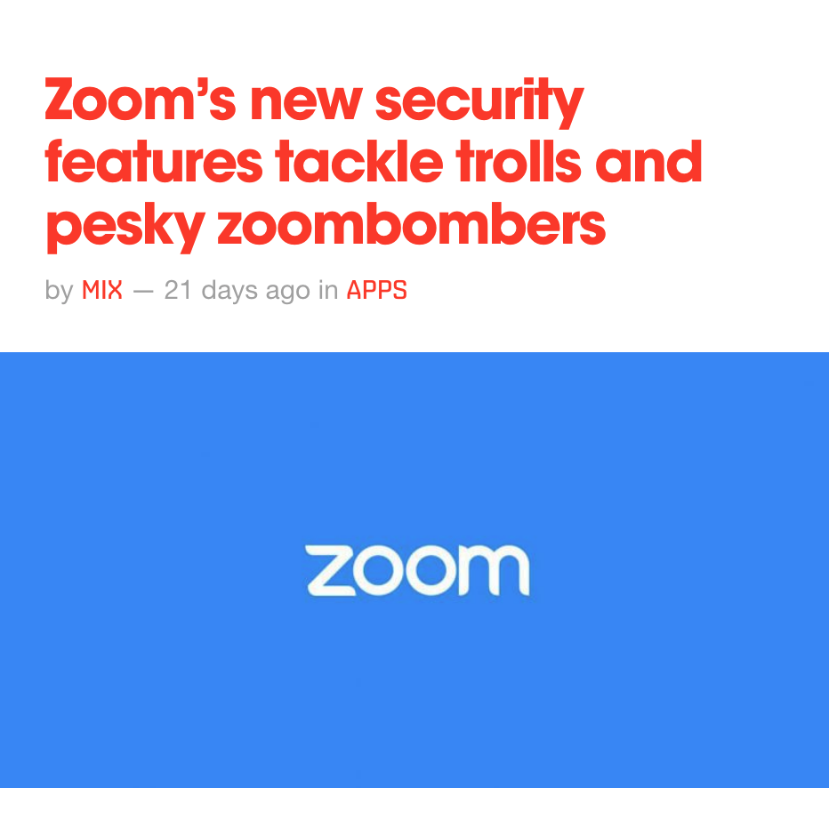
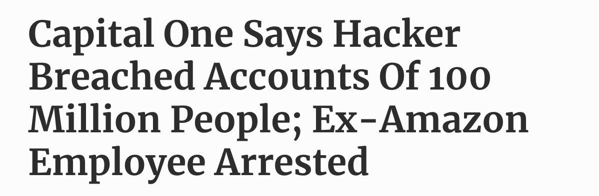

build-lists: true
slidenumbers: true
footer: Security is not a feature‼️  - [@ianaya89](http://twitter.com/ianaya89)

# Security is not a feature‼️ 
# 🥷🚨

^ Intro to web sec, a friendly reminder of why all of us are important in the sec process (even frontenders)

---
# 🇦🇷 Nacho Anaya
## 🐦 [@ianaya89](https://twitter.com/ianaya89)

- 🦝 Lead OSS Engineer [@ChecklyHQ](https://twitter.com/@ChecklyHQ)
- 👨‍🚀 Ambassador [@Auth0](https://twitter.com/@auth0)
- 📺 Streaming [@ianaya89](https://twich.tv/ianaya89)


---

# 🤔

^ Is my duty as front end taking care about sec?
^ Sec is a team work, front, back, qa, devops, clients/users

---

# 🙋‍♀️🙋‍♂️

^ How many of you have been hacked?

---

# "There are two types of companies: those that have been hacked, and those who don't know they have been hacked."

###### John T. Chambers

^ I love quotes, you will see a few in this talk

---

# 🔝

^ Understand the problem

---

# 🦠 😷

^ I will use as example one of the greatest protagonist of 2020 (besides covid)

---


^ Those are probably the most heard words of 2020
^ One of the importan players last year was zoom (and video apps)

---

[.column]


[.column]


---




^ Almost 10 years with vulnerabilities
^ always insecure, but it becomes massive 
^ spotlight 

---

[.column]


[.column]




---

# 📈 ~11.3 Billons

^ of stolen records
^ increase year by year (breaches duplicate from 2017 to 2020)
^ some times, we don't even notice those breaches

#### [informationisbeautiful.net/visualizations/worlds-biggest-data-breaches-hacks](https://www.informationisbeautiful.net/visualizations/worlds-biggest-data-breaches-hacks)

---


^ breaches over the history in modern internet
^ increase year by year
^ big players

---

# 🙇

^ Why/how is that possible?

---

# 🏎 ... 🚗
## 🏁 Uneven Competition


^ Hacker vs Programmer

---

# 😰

^ When we lose, we suffer we suffer damage

---

# 💸 Lose Money

^ Every leak has money consequences, stocks, penalties, law suit

---

# 🤬 Lose Trust

^ We loose trust, we loose users, unable to take care of their data

---

# 🛣

^ Ready for a long term solution, is long way and that way starts with A security culture

---

# ✍️ Culture

- 📚 Training
- 📓 Politics
- ⏱ Time
- 💵 Money 👈

^ What I mean with sec culture? Values and knowledge we have to adquire

---

#  "If you spend more on coffee than on IT security, you will be hacked. What's more, you deserve to be hacked"

###### Richard A. Clarke

^ second quote

---

# 📚 📓 ⏱ 💵
## Invest!

^ You have to invest NOW

---

# 🔚 🔜

^ Soooner o later You will invest. You have the chance to do it now, or later when became more expensive and you have to pay consequences

^ PAUSA

---

# 🧠 Systemic Thinking

^ Besides culture, we also need to start using 
^ seguridad, UX, a11y, performance

---

# 🐜 Vulnerabilities

^ Everything small thing connect to the internet has the power to take down to world biggest site.

---

# "Vulnerabilities are like ants, they are everywhere"

###### Nacho Anaya

^ philosopher 

---


##### [Heartbleed](https://heartbleed.com/)

^ SSL bug from 2011 but discovered on 2014 (digital ocean, aws, azure, every web server was exposed). Let read memory data from the server, steal it and impersonate users.

---


^ Popular and dangerous vulnerabilities available in npm packages(related to SSL)

---

# 🕸 Web is Complex

^ the reason for vulnerabilities is that...

---

# 🕸

## HTTP/S - WebSockets - DNS - TCP 
## FTP - IPv4 - IPv6 - SSH- ASCII - IRC 

^ protocols and services. Thousands of lines of code that have vulnerabilities

---

# 🧭 Browsers too

---

# 🧭
# HTML - CSS - JS

^ Parsing and redenring (painful specs)

---

# 🧭
## DOM - Geolocation - Multimedia 
## Fetch - Web Sockets - Storage

---

# 🤷‍♂️

^ Is not an easy problem, but at least we understand the it now
^ PUASA

---

# 📝 The Solution

^ so now, we can try to understand the solution

---

# 😩 No perfect solution

^ If someone has enough resources and time, they will probably hack us

---

# 💪 But we can be ready

^ security is about mitigate risks
^ control the damage
^ "If thieves break the door of your house, have everything valuable under lock"

---

# 📼

---

# 🙏 Security is not "nice to have"

^ We can't pray for our app sec\
^ we can't wait to be lucky

---

# 👌 Security is by default

^ Design your app to be secure from the ground up.
^ Security should be part as our dev process, not something we only check before going to production. 
^ Undertand our code (and the vulnerabilities), know our deps, have a security team, have security tests, stay updated, and apply best practices

---

# 💥 Assume the worst

^ Think that your data could be compromised, try to make things harder for hackers and take precautions.

---

#  ALWAYS ‼️

^ security by obscurity or security by ignorance

---

# 🤝 Your app is your bestie

^ Your best friend... Intended functionality, intended behavior, know your inputs, know what produces as output. 
^ How your data flow works. Data from page A, is shown on page B and calculated in page C.

---

#  🚪 Input vectors

^ All possible ways that your app could receive data, all possible inputs

---

# 🚪
### Query String - URL Path - Request Body - Cookies
### Request Headers - Form Fields - File Inputs 
### Emails - Web Socket - Browser Storage - Hooks

---

## ⚠️ Never trust your users


^ Imagine users are like Argentinian politicians. They will never do what they said will do. You can't trust them
^ Malicious but also ignorance
^ PAUSE

---

# 🦾

^ most basic/important stuff for web app security

---

# 🔒 HTTPS

## 😏 2021

^ Encrypted HTTP. No excuse, used to be a pain and expensive. Now is super easy and free. Free certificates with lets encrypt (backed by big companies and linux foundation). Prevent MITM too.

---


---

# ⬇️ LTS

^ apache, node, nginx, ubuntu
^ long term support

---

#  Dependencies

^ Probably the most important
^ most of the error

---


---

# 📝 "Your code is not your code, but their bugs are your bugs."

###### Nacho Anaya

^ We inherit vulnerabilities

---

# 🔷 eslint-scope

#### [eslint.org/blog/2018/07/postmortem-for-malicious-package-publishes](https://eslint.org/blog/2018/07/postmortem-for-malicious-package-publishes)

^ hikacked and tried to stole npm tokens
^ you don't probably know the deep, but is present in almost every web app

---

[.column]


[.column]


---

<br>
<br>
<br>
<br>
<br>

#  

#   

^ much better now

---

<br>
<br>
<br>
<br>
<br>

#    

^ tested, audited, encoding, escaping
^ use strict

---


# 💉 [SQL / No-SQL Injection](https://owasp.org/www-community/attacks/SQL_Injection)

^ attempt to intruduce malicious code in database queries
^ oldes attack but still relevant
^ recent case in Stanford university (75kusd)

---


^ is it a myth?

---


---

# 💉 SQL / No-SQL Injection 

- ‼️ Server Side Validation 
- 🧼 Sanitize queries
- 🛠 ORM / ODM

^ Client validation is ok but is only UX. Especially function arguments and db values. Sanitization is clean the input to prevent security exploits.

---

# 🤞 [XSS](https://owasp.org/www-community/attacks/xss/)

^ Cross site scripting: run malicius code in user browser. Access to storages, Cookies, web redirection, sensitive data
^ reflected, stored, Dom based,
^ easy to detect but could me massive
^ csrf users scoped and hard to detect
^ blog sample,

---


^ If that happened to Marc, could happen to us

---

# 🤞XSS

- ‼️ Server Side Validation 
- 🧼 Sanitize inputs
- 🧮 HTML encoding
- 🖼 Frameworks
- 🪖 HTTP Secure Response Headers

^ When creating dynamic content from user input, prevent html. At least skip <script> tags
^ hits, hpkp, xls protection, content-security-polcy

---

# 🪖 XSS Headers

```
- HSTS
- HPKP
- X-Frame-Options
- X-XSS-Protection
- X-Content-Type-Options
- Referrer-Policy
- Expect-CT
- Content-Security-Policy 👈
```

#### [Secure Headers](https://github.com/goldbergyoni/nodebestpractices/blob/security-best-practices-section/sections/security/secureheaders.md)

^ All of them used by browsers to help limit attacks. You can dive on this headers laters, all of them are very useful to prevent XSS attacks.   
^ CSP: Limit xss (what kind of content can be opened, request can be made, limit data sources).
^ Check helmet library for express, if you are not using express, check the code to apply those best practices.

---

# 😵 [DoS](https://owasp.org/www-community/attacks/Denial_of_Service)

^ Denial of service, make your system inaccesible 
^ crash it, saturate it, over load it
^ AWS, Github, CloudFlare

---


^ wiki leaks
^ torrents
^ ddos

---

# 😵 DoS

- ⌛️ Rate Limiting
- ❌ Error handling
- 💥 Explicit Crashes
- 🔤 Exponential Regex
- 📵 IP Banning 

^ regex exponenciales
^ no crasher por user input
^ no exponer información en los errores

---

# 🗂 Sessions & Tokens

^ Use auth flaws to impersonate users.

---

# 🗂 Sessions & Tokens

- ⏱ Expirable
- 🚫 Allow List or Deny List
- 🆔 OAUTH - OpenID
- 🔐 Single Sign On

^ No exponernos

---

# 🗝 Passwords

^ Often handled incorrectly, no plain text or encrypted. Hash it with proper algorithms. If your data is stolen, at least will not be compromised

---


## [Time to crack](https://www.betterbuys.com/estimating-password-cracking-times/)

^ enforce strict password policies

---

# 🗝 Passwords

- #️⃣ hash + salt (bcrypt)
- 🦾 Strong Passwords (Entropy)
- 📲 2FA / MFA 

^ Hash algorithm, is powerful but slow. Will be hard to brute force it. Bcrypt for all languages
^ cuidado con la longitud

---

### 🗝 🔓 Have I been pawned?


### [https://haveibeenpwned.com](https://haveibeenpwned.com)

---

### 🗝 🔓 Have I been pawned?


### [https://haveibeenpwned.com](https://haveibeenpwned.com)

---

### 🗝 🔓 Have I been pawned?

### 💾 API & DB


^ chrome and firefox are doing it automatically

---

# 🤫 Dev Passwords & Secrets

- 🔁 CI
- 🪓 Dev Tools
- 🌨 Cloud
- 🤐 Keys - Tokens - Secrets

---

# 🤫  Dev Passwords & Secrets

<br>

[.column]
- [Blackbox](https://github.com/StackExchange/blackbox)
- [Keybase](https://keybase.io)
- [GPG](https://gnupg.org/)

[.column]
- Password Managers
- [Secret Manager](https://aws.amazon.com/secrets-manager/) (AWS)
- MFA 👈

^ no guardar en repos

---

# 🍪 Cookies

^ don't compromise data to xss

---

# 🍪 🚩 Cookies Flags

- `httpOnly`
- `secure`
- `SameSite`

^ not accessed via js and only https

---

# 🍪 ↩️ Cookies Scoping

- domain
- path
- expires

---

# 🗃 Logging & Monitoring

^ Have records is important (but with balance). Excesive logging could provide information to attackers. Especially in clients. Limit logging in production. Disable headers that provide tech information like (X-Powered-By)

---

# 🗃 🛠 Logging & Monitoring
<br>


-  🖥 Monitoring: [datadog](https://www.datadoghq.com/) / [new relic](https://newrelic.com/)  
- 🐛 Errors: [sentry](https://sentry.io) / [bugsnag](https://www.bugsnag.com/) 
- 📜 Logs:  [papertrail](https://www.papertrail.com/) / [loggly](https://www.loggly.com/)
- 🚦 Status:  [checkly](https://www.checklyhq.com/) / [pingdom](https://www.pingdom.com/)

---

# 💳 🏥
## Sensitive Data

---


^ Just don't
^ encrypt on rest
^ Don't break user trust, don't store it in browser. Always SSL, disable caching on sensitive forms

---


---

# 📻 OWASP Top 10

## [owasp.org](https://owasp.org)

^ Stay tune to OWAS. Is a open source project that tracks vulnerabilities and  make reports. They have this top 10 that is updated every year. Most of the them were covered here.


---

# 🐐 WebGoat

<br>
<br>

```bash
$ docker pull webgoat/webgoat-8.0

$ docker run -p 8080:8080 -t webgoat/webgoat-8.0
```


---

# 🎒 Take Away


^ debemos invertir y capacitarnos en seguridad 
^ conocer nuestras apps y saber como pueden ser hackeadas
^ aplicar buenas practicas y e incorporar la seguridad al día a día (code reviews, auditorias, pen testing, qa)

---


^ We are as secure as our weakest link

---

# 👊 Start taking care

---

# 🧠

^ Change your mindset, and star using systemic thinking and take care of sec, a11y ux and the whole parts of the dev process

---


# 👏 Thanks!

## 👇 Questions?

### 🐦 [@ianaya89](https://twitter.com/ianaya89)

<br>

[.column]


[.column]


[.column]


[.column]


